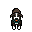

# Stardew Always



An anniversary gift for my wife, adding our dog to Stardew Valley.

# Useful Tools

- [EZGif Sprite Cutter](https://ezgif.com/sprite-cutter) - When you have a tileset in a png and need them split up
- [GIMP](https://www.gimp.org) - How tf do people do art stuff nowadays? There's probably some tiktok genz ai tool now but hey, I don't mind clicking in pixels by hand for this
- [Vortex](https://www.nexusmods.com/about/vortex) - To load mods in Stardew Valley
- [SMAPI](https://smapi.io/) - The Stardew Valley Modding API
- [Content Patcher](https://www.nexusmods.com/stardewvalley/mods/1915) - Replaces data in the game with whatever you want, so mods don't have to use C# and change any data forever. CP mods are easier to make and can be very powerful. And if you remove the mod, the save will still load since CP just replaces textures and data instead of overriting or adding new data. More info can be found [here](https://stardewvalleywiki.com/Modding:Modder_Guide/Get_Started) and [here](https://github.com/Pathoschild/StardewMods/blob/stable/ContentPatcher/docs/extensibility.md#readme)

# Sprite Info

- For the shadows in the pixel art sprites, I went with the color black (#000000), and a pencil tool opacity of 38.0 using GIMP

# How to Use

If you want to add your dog to Stardew Valley, you'll need SMAPI, Content Patcher, the very simple mod [CP] DoggyMod from this repo, and a custom tilesheet for your dog. Copy in your tilesheet as [CP] DoggyMod/assets/doggy-tilesheet.png and then copy the folder into the Mods directory in the game folder. Then run with Vortex.

The mod replaces the Dog 1, so if your farm uses Dog 2 or 3, edit the content.json file with the line "Target": "Animals/dog", . Change this to "Target": "Animals/dog2", or "Target": "Animals/dog3", for whichever dog you chose for your farm. You can also duplicate the block entirely and do it for all the dogs like

```
"Format": "2.0.0",
"Changes": [
    {
        "Action": "EditImage",
        "Target": "Animals/dog",
        "FromFile": "assets/doggy-tileset.png"
    },
    {
        "Action": "EditImage",
        "Target": "Animals/dog2",
        "FromFile": "assets/doggy-tileset.png"
    },
    {
        "Action": "EditImage",
        "Target": "Animals/dog3",
        "FromFile": "assets/doggy-tileset.png"
    }
    ...
],
```